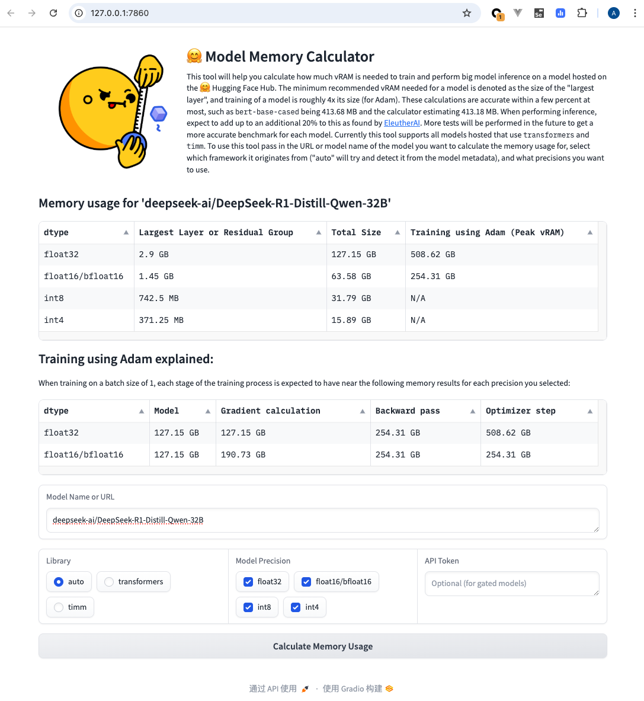

Check out the configuration reference at https://huggingface.co/docs/hub/spaces-config-reference

---


README of `hotfix` Branch
=========================

Click [here](https://github.com/AlphaHinex/model-memory-usage/compare/main...hotfix) (or as below) to check differences between original [main](https://huggingface.co/spaces/hf-accelerate/model-memory-usage/tree/main) branch and `hotfix` branch.

```diff
diff --git a/requirements.txt b/requirements.txt
index c3896f5..918ea24 100644
--- a/requirements.txt
+++ b/requirements.txt
@@ -3,4 +3,5 @@ transformers
 timm
 huggingface_hub==0.19.4
 tabulate
-einops
\ No newline at end of file
+einops
+gradio==4.43.0
diff --git a/src/app.py b/src/app.py
index 7a5e23e..500023a 100644
--- a/src/app.py
+++ b/src/app.py
@@ -7,6 +7,8 @@ from model_utils import calculate_memory, get_model


 def get_results(model_name: str, library: str, options: list, access_token: str):
+    if access_token == "":
+        access_token = None
     model = get_model(model_name, library, access_token)
     # try:
     #     has_discussion = check_for_discussion(model_name)
```

How to run locally
------------------

1. Use python 3.8 version
2. `pip install -r requirements.txt`
3. `python src/app.py`

